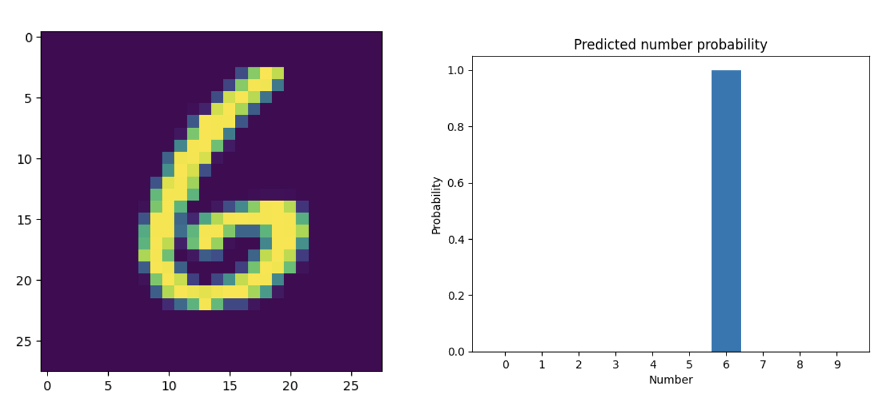

# CCNN

## Machine learning models

For now, only the LeNet model is available. Since CCNN doesn't have training support (it only does inference), the model has been trained in TensorFlow/Keras. The weights are stored in the `src/models/lenet/data` directory. The input image is a grayscale handwritten number "6" from the MNIST dataset (used to train our LeNet model).

<div style="text-align:center;">
  
</div>

## Installation

This C++ project uses CMake 3.10. It uses the PAPI library to provide useful profiling utility functions.

### Quick install

CMake will automatically detect if you have the PAPI library installed on your computer and build with or without profiling support depending on that.

```sh
mkdir build
cd build
cmake ..
cmake --build .
```

### Profiling support

You can manually set the `ENABLE_PROFILING` flag to enable or disable profiling support. Setting it to 0 will disable profiling support, while setting it to anything else will enable profiling support.

The following commands will disable profiling suport:

```sh
mkdir build
cd build
cmake -DENABLE_PROFILING=0 ..
cmake --build .
```

The following commands will enable profiling suport:

```sh
mkdir build
cd build
cmake -DENABLE_PROFILING=1 ..
cmake --build .
```

## Execution

To run the executable in the `build` directory, run the following command:

```sh
./ccnn
```

Additionally, some CLI arguments are available:

- `--debug` flag (or `-d`): print every step on your terminal (intermediate feature maps, filters, biases and the result).
- `--batchsize=<int>` option: specify a batch size (defaults to `1`). Since there is only one input image, this will duplicate the input `n` times.
- `--profile=<list int>` option: specify the IDs of the layers you want to profile.

An example of running CCNN with a batchsize of 256 and profiling enabled for layers 1 and 3:

```sh
./ccnn --batchsize=256 --profile=1,3
```

> Note: you cannot run both `--debug` and `--profile` at the same time because profiling times will be affected by the debugging code.
